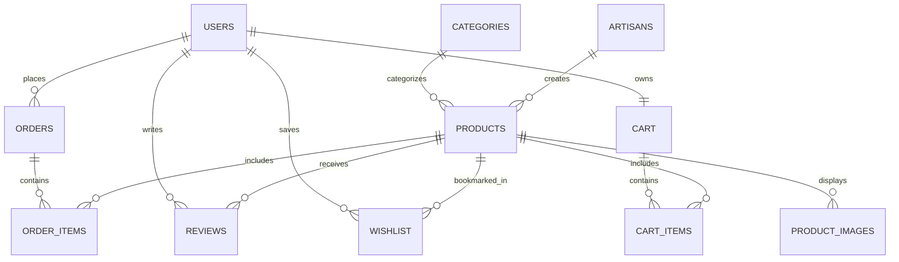

# Craftora — MySQL Database Schema & ER Model

Craftora operates on **MySQL 8.0 InnoDB** with 11 normalized relational tables enforcing referential integrity.

---

## 1. Entity Relationship (ER) Diagram

---

## 2. Table Definitions

### 1. `users`
Stores customer and administrator authentication credentials and roles.
- `id` (INT, PK, AUTO_INCREMENT)
- `name` (VARCHAR(100), NOT NULL)
- `email` (VARCHAR(150), UNIQUE, NOT NULL)
- `password_hash` (VARCHAR(255), NOT NULL)
- `avatar` (TEXT)
- `role` (ENUM('USER', 'ADMIN'), DEFAULT 'USER')
- `created_at` (DATETIME, DEFAULT CURRENT_TIMESTAMP)

### 2. `categories`
Organizes crafts by traditional discipline (Pottery, Handloom, etc.).
- `id` (INT, PK, AUTO_INCREMENT)
- `name` (VARCHAR(100), UNIQUE, NOT NULL)
- `slug` (VARCHAR(100), UNIQUE, NOT NULL)
- `description` (TEXT)
- `image` (TEXT)

### 3. `artisans`
Profiles for rural master craftspeople and studio clusters.
- `id` (INT, PK, AUTO_INCREMENT)
- `name` (VARCHAR(100), NOT NULL)
- `bio` (TEXT)
- `specialty` (VARCHAR(100), NOT NULL)
- `location` (VARCHAR(100), NOT NULL)
- `image` (TEXT)
- `experience` (VARCHAR(50))
- `rating` (DECIMAL(3, 2), DEFAULT 5.00)

### 4. `products`
Handmade catalog items.
- `id` (INT, PK, AUTO_INCREMENT)
- `name` (VARCHAR(200), NOT NULL)
- `description` (TEXT)
- `price` (DECIMAL(10, 2), NOT NULL)
- `stock_quantity` (INT, DEFAULT 0)
- `category_id` (INT, FK -> categories.id)
- `artisan_id` (INT, FK -> artisans.id)
- `image` (TEXT)
- `rating` (DECIMAL(3, 2), DEFAULT 5.00)
- `is_featured` (BOOLEAN, DEFAULT FALSE)

### 5. `orders` & `order_items`
ACID checkout transaction records.
- `orders`: `id`, `user_id` (FK), `total_amount`, `shipping_address`, `city`, `state`, `pincode`, `phone`, `order_status` (*Confirmed, Shipped, Delivered, Cancelled*), `payment_status`, `created_at`.
- `order_items`: `id`, `order_id` (FK), `product_id` (FK), `quantity`, `price` (snapshot price at moment of purchase).

### 6. `cart` & `cart_items`
Persistent user shopping baskets.

### 7. `wishlist`
Product bookmarks (`UNIQUE KEY unique_wishlist (user_id, product_id)`).

### 8. `reviews`
Patron feedback and ratings recalculating average product scores (`UNIQUE KEY unique_user_product_review (user_id, product_id)`).
